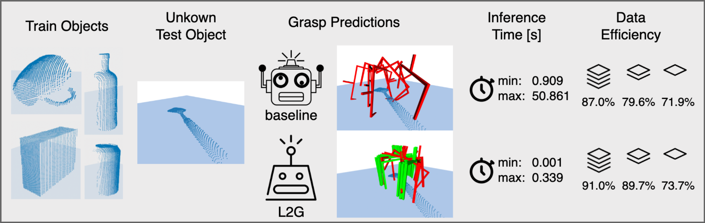

# End-to-End Learning to Grasp from Object Point Clouds
This is the **[PyTorch](https://pytorch.org)** implementation of the paper **[Learning to Grasp (*L2G*)](https://doi.org/10.48550/arXiv.2203.05585)**. <br><br>
**Learning to Grasp (*L2G*)** is an efficient end-to-end learning strategy to generate 6-DOF parallel-jaw grasps starting from a partial point cloud of an object. Our approach does not exploit any geometric assumption, it is instead guided by a principled multi-task optimization objective that generates a diverse set of grasps by combining **contact point sampling**, **grasp regression**, and **grasp evaluation**.
<p align="center">  
  
</p>

## Environment
This code is tested with Python 3.7.12, PyTorch 1.8.0 and CUDA 11.1 (system-wide). <br>
Make sure to have the following environment variables (CUDA_HOME, CUDA_ROOT, LD_LIBRARY_PATH, PATH) properly set before installing pointnet2 modules. GCC and CMAKE are also required.

```
SYSTEM:
    CUDA 11.1 (system-wide)
    gcc-7.3.1
    cmake-3.18.4
    
CONDA ENV:
    torch: 1.8.0    # torch.__version__
    CUDA: 11.1  # torch.version.cuda
    CuDNN: 8005 # torch.backends.cudnn.version()
```

- Use miniconda and the provided requirements.yml file to build a virtual environment. This will install almost all needed packages, including pytorch=1.8.0 and cudatoolkit=11.1
```shell
conda env create --name L2G_env --file=requirements.yml
```

- Install KNN CUDA
```shell
pip install --upgrade https://github.com/unlimblue/KNN_CUDA/releases/download/0.2/KNN_CUDA-0.2-py3-none-any.whl
```

- Install PointNet++
```shell
cd pointnet2;
python setup.py install;
cd ..
```

- Install GPNet-simulator and grasp-evaluator
```shell
git submodule init 
git submodule update
cd GPNet-simulator; pip install -e .; cd ..
cd grasp-evaluator; python setup.py install; cd ..
```

## Datasets
- ShapeNetSem-8: Originally created by [Wu et al. (2020)](https://papers.nips.cc/paper/2020/hash/994d1cad9132e48c993d58b492f71fc1-Abstract.html)
    and first provided [here](https://github.com/Gorilla-Lab-SCUT/GPNet). Used for training and evaluation.
- YCB-8: Grasping scenarios with 8 YCB objects including grasp annotations for simulation-based as well as rule-based evaluation.
- YCB-76: Grasping scenarios with 76 YCB objects for simulation-based evaluation only.
<br>

Use the script: **download_data.sh** to download the datasets (requires ~11GB disk space once unzipped). For a more detailed description of the datasets, please refer to their individual README files.
```shell
sh download_data.sh;
```

- Directory tree:
```
.
├── README.md
└── data
    ├── ShapeNetSem-8
    │   └── ...
    ├── YCB-76
    │   └── ...
    ├── YCB-8
    │   └── ...
    └── download_script.sh
                
```


## Experiments
Use the provided bash scripts to train and evaluate L2G models. Training is performed on ShapeNetSem-8, evaluation (rule-based + simulation) is performed on ShapeNetSem-8, YCB-8, YCB-76 test sets.

- Train and Evaluate **L2G with PointNet2 Encoder**
```shell
conda activate L2G_env
source run_l2g_pn2.sh
```

- Train and Evaluate **L2G with DeCo Encoder**
```shell
conda activate L2G_env
source run_l2g_deco.sh
```

## TODOs
- [x] Upload Code
- [x] Upload Data
- [ ] Real-World experiments video
- [ ] Link to the arXiv and citation

## Acknowledgement
Our code release is based on the following works
* [antoalli/Deco](https://github.com/antoalli/Deco): Denoise and Contrast for Category Agnostic Shape Completion (encoder).
* [sshaoshuai/Pointnet2.PyTorch](https://github.com/sshaoshuai/Pointnet2.PyTorch): PointNet2 encoder implementation.
* [itailang/SampleNet](https://github.com/itailang/SampleNet): SampleNet: Differentiable Point Cloud Sampling
* [Gorilla-Lab-SCUT/GPNet](https://github.com/Gorilla-Lab-SCUT/GPNet): Grasp Proposal Networks: An End-to-End Solution for Visual Learning of Robotic Grasps


This work is partially funded by CHIST-ERA under EPSRC grant no. EP/S032487/1.
